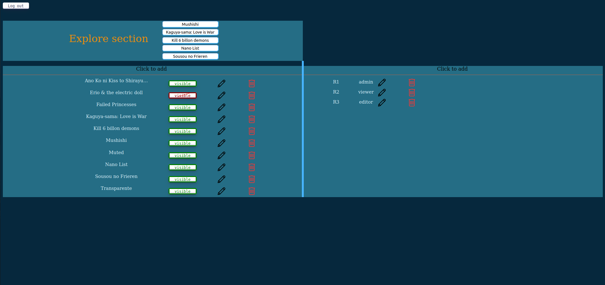
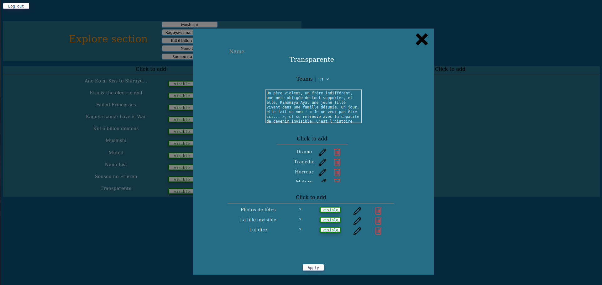

# MangaSite Admin Front

This is the front for the admin part of the [MangaSite Project](https://github.com/Akutchi/MangaSite/tree/master).

## Important Notice
For the decryption part in the encryption/decryption scheme for the login; I used at the time
```key.setOptions({encryptionScheme: "pkcs1"});```

However, since the 29/08/24, date at which I created this repository, it so happened that a security breach was fixed that has as a consequence that pkcs1 cannot be used anymore.
As such, the login bug if someone tries to login. Unfortunately, every attempt at solving this issue resulted in failure [1].

visuals :

|  |
|:--:|
| *Login Page* |

|  |
|:--:|
| *Home Page* |

|  |
|:--:|
| *Manga Edition Page* |

[1] Tried to change the encryption scheme, to change the option to {environment: "browser"}, tried to use NODE_OPTION.

# Installation
This repository should be used in tandem with the principal repository that contains the client front and the server.
To install the necessary dependencies, please see the [front setup](./doc/front/front_setup.md) file

# To be done

This version is still in developpment as several components still needs to be created :
- Solving the decryption issue
- The visibility of each manga / chapter
- The roles
- Every link other than the explore section (which works)
